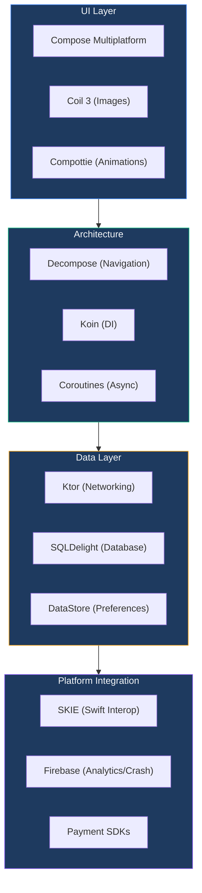

# Tech Stack

## Overview

The Chalo App leverages **Kotlin Multiplatform (KMP)** as its foundation, enabling code sharing between Android and iOS while using modern, production-grade libraries for each concern. The stack prioritizes libraries with strong multiplatform support, minimizing platform-specific code and enabling a unified development experience.

## Technology Landscape

## Core Platform

### Language & Framework

The entire shared codebase is written in Kotlin, with Swift used only for iOS-specific shell code and platform bridges.

| Technology | Version | Role |
|------------|---------|------|
| Kotlin | 2.2.20 | Primary language for all shared and Android code |
| Kotlin Multiplatform | 2.2.20 | Cross-platform framework enabling iOS/Android code sharing |
| Swift | — | iOS application shell and native UI bridges |

### Build Tooling

| Tool | Version | Purpose |
|------|---------|---------|
| Gradle | 8.x | Build automation with Kotlin DSL |
| Android Gradle Plugin | 8.13.0 | Android build configuration |
| CocoaPods | — | iOS dependency management and KMP framework integration |

### Android SDK Targets

The app supports a wide range of Android devices while targeting the latest platform features.

| Target | API Level | Android Version |
|--------|-----------|-----------------|
| Minimum | 23 | Android 6.0 (Marshmallow) |
| Target | 35 | Android 15 |
| Compile | 36 | Android 16 (preview) |

## User Interface

### Compose Multiplatform

The UI is built entirely with **Compose Multiplatform**, enabling a single declarative UI codebase for both platforms. This represents a significant architectural decision—the app uses Compose even on iOS rather than SwiftUI for feature screens.

| Library | Version | Responsibility |
|---------|---------|----------------|
| Compose Multiplatform | 1.9.1 | Cross-platform declarative UI framework |
| Compose UI | 1.8.0 | Core UI components and layout system |
| Activity Compose | 1.10.1 | Android Activity integration for Compose |

### Visual Assets

| Library | Platform | Version | Purpose |
|---------|----------|---------|---------|
| Coil 3 | Shared | 3.3.0 | Multiplatform image loading with caching, transformations, and Compose integration |
| Compottie | Shared | 2.0.1 | Multiplatform Lottie animation rendering |
| Lottie Compose | Android | 6.6.10 | Native Android Lottie support as fallback |
| Maps Compose | Android | 6.12.2 | Google Maps integration with Compose |

## Architecture Libraries

### Decompose (Navigation & Lifecycle)

**Decompose** is the backbone of the app's navigation and component architecture. It provides lifecycle-aware navigation with type-safe routing, state preservation across configuration changes, and seamless back-handling—all in a multiplatform way.

| Library | Version | Responsibility |
|---------|---------|----------------|
| Decompose | 3.4.0 | Navigation stack management and component lifecycle |
| Decompose Compose | 3.4.0 | Compose integration for Decompose components |
| Essenty Lifecycle | 2.5.0 | Lifecycle primitives used by Decompose |

Decompose was chosen over Jetpack Navigation for its cross-platform support, superior testability, and component-based architecture that maps cleanly to the MVI pattern.

### Koin (Dependency Injection)

**Koin** provides lightweight, multiplatform dependency injection without code generation or annotation processing.

| Library | Version | Responsibility |
|---------|---------|----------------|
| Koin Core | 4.1.1 | Multiplatform DI container |
| Koin Android | 4.1.1 | Android-specific extensions (ViewModel scope, Context) |
| Koin Compose | 4.1.1 | Compose integration for scoped dependencies |

Koin was selected over Hilt because Hilt is Android-only, while Koin provides seamless multiplatform support with a simpler setup.

### Coroutines (Asynchronous Programming)

All asynchronous operations use **Kotlin Coroutines**, providing structured concurrency with cancellation support.

| Library | Version | Purpose |
|---------|---------|---------|
| Kotlinx Coroutines | 1.10.2 | Core coroutine primitives and Flow |
| Kotlinx Coroutines Android | 1.10.2 | Main dispatcher for Android UI thread |
| Kotlinx DateTime | 0.7.1 | Multiplatform date/time handling |

## Networking

### Ktor Client

**Ktor** provides the HTTP client foundation with platform-specific engines for optimal performance.

| Library | Version | Purpose |
|---------|---------|---------|
| Ktor Client Core | 3.3.1 | Multiplatform HTTP client |
| Ktor Content Negotiation | 3.3.1 | Request/response serialization |
| Ktor Serialization | 3.3.1 | Kotlinx serialization integration |
| Ktor OkHttp | 3.3.1 | Android HTTP engine (OkHttp-based) |
| Ktor Darwin | 3.3.1 | iOS HTTP engine (URLSession-based) |

### Supporting Network Libraries

| Library | Platform | Version | Purpose |
|---------|----------|---------|---------|
| Socket.IO | Android | 1.0.2 | Real-time bidirectional communication for live tracking |
| Chucker | Android | 4.2.0 | HTTP request/response inspector for debug builds |

## Data Persistence

### SQLDelight (Database)

**SQLDelight** generates type-safe Kotlin APIs from SQL statements, providing compile-time verification and multiplatform database access.

| Library | Version | Purpose |
|---------|---------|---------|
| SQLDelight | 2.1.0 | SQL-to-Kotlin code generation |
| SQLDelight Android Driver | 2.1.0 | Android SQLite driver |
| SQLDelight Native Driver | 2.1.0 | iOS SQLite driver |
| SQLDelight Coroutines | 2.1.0 | Flow-based reactive queries |
| SQLCipher | 4.11.0 | Database encryption (Android) |

### Preferences Storage

| Library | Version | Purpose |
|---------|---------|---------|
| DataStore Preferences | 1.1.7 | Type-safe key-value storage replacing SharedPreferences |
| Multiplatform Settings | 1.1.1 | Cross-platform preferences abstraction |
| Security Crypto | 1.1.0 | Encrypted SharedPreferences (Android) |

## Payment Integrations

The app integrates multiple payment providers to support various payment methods across Indian markets.

| Provider | Platform | Version | Capabilities |
|----------|----------|---------|--------------|
| Razorpay Custom UI | Android | 3.9.11 | UPI, cards, net banking, wallets |
| Juspay HyperSDK | Android | 2.0.6 | Payment orchestration and routing |
| Inai SDK | Android | 0.1.36 | Alternative payment processing |
| CCAvenue (Uvik) | Android | 1.1.0 | Additional payment gateway |

## Analytics & Monitoring

### Event Tracking

| Provider | Platform | Version | Purpose |
|----------|----------|---------|---------|
| Mixpanel | Android | 6.1.1 | User analytics, funnel analysis, retention tracking |
| Firebase Analytics | Shared | (BOM 34.4.0) | Event tracking and audience segmentation |
| Adjust | Android | 4.33.5 | Attribution analytics for marketing campaigns |
| Plotline | Shared | 1.2.5 | In-app engagement and user messaging |

### Crash Reporting

| Library | Platform | Version | Purpose |
|---------|----------|---------|---------|
| Firebase Crashlytics | Shared | (BOM 34.4.0) | Crash reporting and analysis |
| CrashKiOS | iOS | 0.9.0 | iOS crash reporting bridge for Kotlin exceptions |

## Maps & Location

| Library | Platform | Version | Purpose |
|---------|----------|---------|---------|
| Play Services Maps | Android | 19.2.0 | Google Maps SDK |
| Play Services Location | Android | 21.3.0 | Fused location provider |
| Android Maps Utils | Android | 3.19.0 | Clustering, polyline decoding, geometry utilities |

iOS uses MapKit directly via native UI bridges for map rendering.

## Authentication

| Library | Platform | Version | Purpose |
|---------|----------|---------|---------|
| Truecaller SDK | Android | 2.7.0 | One-tap phone number verification |
| Play Services Auth | Android | 21.4.0 | Google Sign-In capabilities |
| SMS Retriever API | Android | 18.3.0 | Automatic OTP reading without SMS permissions |

## iOS Interoperability

### SKIE

**SKIE** (Swift Kotlin Interface Enhancer) improves the Swift-facing API generated from Kotlin code, making it more idiomatic for Swift developers.

| Feature | Benefit |
|---------|---------|
| Sealed class interop | Kotlin sealed classes become Swift enums with exhaustive switch statements |
| Enum interop | Better enum representation in Swift |
| Flow bridging | Kotlin Flows become Swift AsyncSequence |
| Coroutine support | Suspend functions become Swift async functions |

## Media & Content

| Library | Platform | Version | Purpose |
|---------|----------|---------|---------|
| ExoPlayer | Android | 2.19.1 | Video playback for promotional content |
| Media3 | Android | 1.3.1 | Modern media framework |
| Image Cropper | Android | 4.5.0 | Profile photo editing |
| ZXing Core | Android | 3.5.1 | QR code and barcode scanning |
| QRose | Shared | 1.0.1 | Multiplatform QR code generation |

## Background Processing

| Library | Platform | Version | Purpose |
|---------|----------|---------|---------|
| WorkManager | Android | 2.8.1 | Reliable background task scheduling |
| KMP Notifier | Shared | 1.6.0 | Multiplatform push notification handling |

## Customer Support

| Library | Platform | Version | Purpose |
|---------|----------|---------|---------|
| Freshchat | Android | 6.4.5 | In-app chat support with agents |

## Security

| Library | Platform | Version | Purpose |
|---------|----------|---------|---------|
| Silent Ride | Android | 2.0.30 | Device security and integrity |
| RootBeer | Android | 0.1.0 | Root detection |
| Security Crypto | Android | 1.1.0 | Encrypted storage (Keystore-backed) |
| SQLCipher | Android | 4.11.0 | Database encryption |

## Testing

| Library | Version | Purpose |
|---------|---------|---------|
| Kotlin Test | 2.2.20 | Multiplatform test assertions |
| JUnit 5 | 5.10.1 | Test runner and lifecycle |
| MockK | 1.13.7 | Kotlin-first mocking framework |
| Turbine | 1.0.0 | Flow testing utilities |
| Robolectric | 4.16 | Android unit testing without emulator |
| Coroutines Test | 1.10.2 | TestDispatcher and runTest utilities |

## Utilities

| Library | Version | Purpose |
|---------|---------|---------|
| Ksoup | 0.6.0 | HTML parsing for web content extraction |
| Kotlinx Serialization | (via plugin) | JSON serialization/deserialization |
| Paging | 3.3.0-alpha02 | Multiplatform pagination for lists |

## Gradle Plugins

The build system uses these Gradle plugins for code generation and build configuration.

| Plugin | Version | Purpose |
|--------|---------|---------|
| Kotlin Multiplatform | 2.2.20 | KMP project configuration |
| Kotlin Serialization | 2.2.20 | JSON serialization code generation |
| Kotlin CocoaPods | 2.2.20 | iOS framework packaging |
| JetBrains Compose | 1.9.1 | Compose Multiplatform compilation |
| SQLDelight | 2.1.0 | Database code generation |
| SKIE | 0.10.8 | Swift interop enhancement |
| Google Services | 4.4.4 | Firebase configuration |
| Firebase Crashlytics | 3.0.6 | Crash reporting integration |

## Technology Selection Rationale

| Choice | Alternatives Considered | Rationale |
|--------|------------------------|-----------|
| **Compose Multiplatform** | SwiftUI + Jetpack Compose | Single UI codebase, faster iteration, consistent behavior |
| **Decompose** | Jetpack Navigation, Voyager | True multiplatform, better testability, lifecycle-aware |
| **Koin** | Hilt, Kodein | Multiplatform support, no annotation processing |
| **Ktor** | Retrofit, OkHttp direct | Multiplatform, coroutines-first, plugin architecture |
| **SQLDelight** | Room, Realm | Multiplatform, SQL-first, compile-time safety |
| **SKIE** | Manual bridging | Automatic Swift-friendly API generation |
